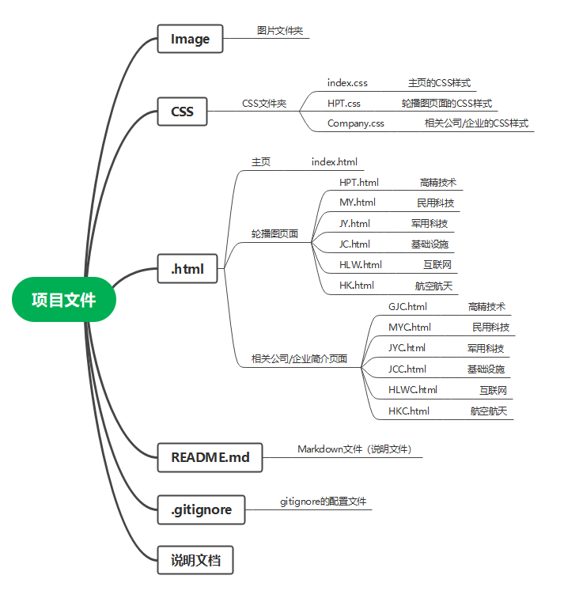
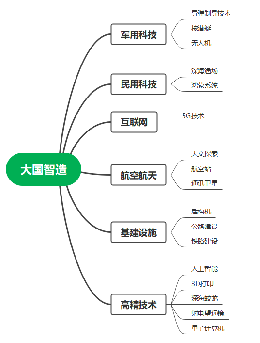
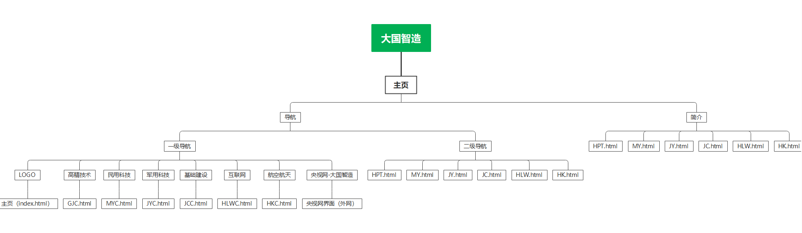
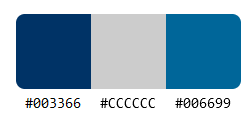
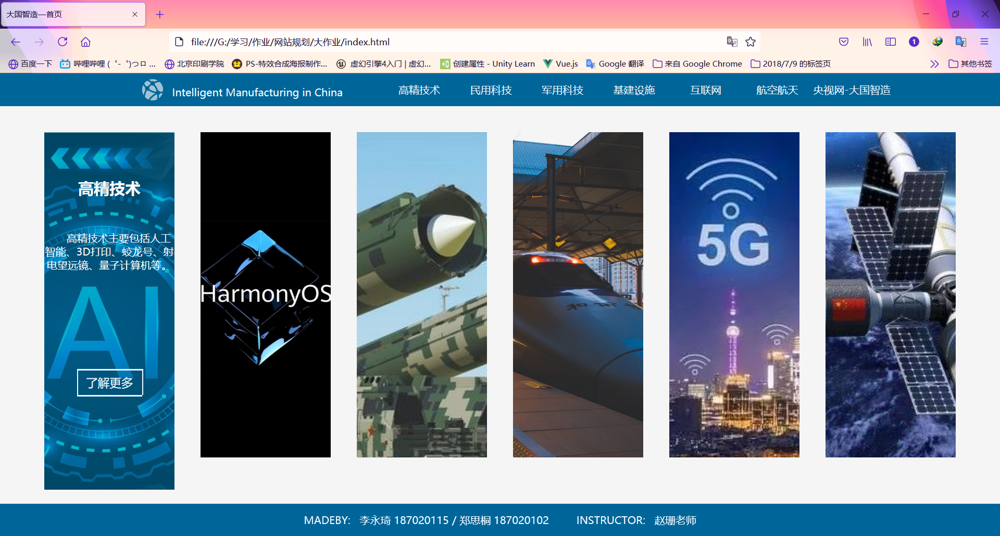

# Siteplanning
网站规划大作业
***

## 1.项目信息
***
### 项目名称：
大国智造
### 开发工具
DW ID  Git Typora
### 开发人员
18数技一班 李永琦 187020115 郑思桐 187020102
### 指导老师
赵珊老师
***

## 2.项目结构
***
### 项目文件结构图

***
### 结构图

***
### 网站架构

***

## 3.网站信息
***
### 配色

***
### 网站截图

***
### 网站说明
网站所有页面都添加了导航栏  
如截图一所示：主页面内容部分有六个图像，分别设计了鼠标经过时的动画效果  
如截图二、三所示：二级页面分为两类，首先点击公共的一级导航或者首页中的图片上的“了解更多”进入对应的的知名公司/企业介绍，即图二，该类页面中内容主要为垂直导航栏，点击导航栏的导航会在右侧加载对应的介绍；其次是公共的二级导航，即水平下拉菜单中的导航，点击进入图三，该类页面主要为相关技术的轮播图，该功能由JS实现，当鼠标移至图片上方，轮播图停止轮播，同时会在图片上层显示介绍，如果想了解更多的话，将会链接至百度百科，轮播图两侧分别有上一个/下一个按钮，点击即可，右下方为图片控制器，鼠标移至其上方轮播图就会自动移至对应图片上。
***
### CSS/JS代码较多请在项目中查看(JS文件在轮播页面中)
***

#### 备注
##### Firefox width: 1536px; height: 711.2px/864px(全屏);
##### 如有显示错误，请是用最新版本的Firefox打开；
##### 联系我们请发送邮件至1741564861@qq.com.
***

