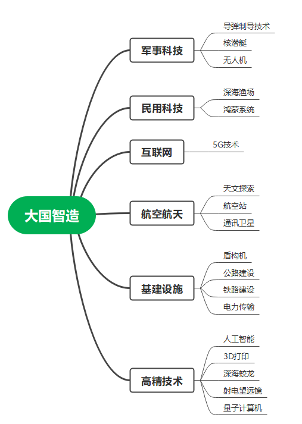
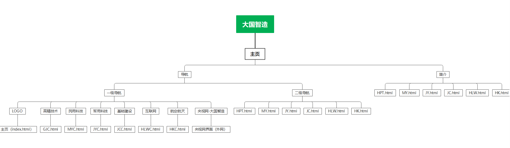
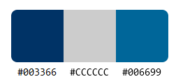

# Siteplanning
网站规划大作业（赵珊）

## 1.项目信息
### 项目名称：
大国智造
### 开发工具
DW ID  Git
### 开发人员
18数技一班 李永琦 187020115 郑思桐 187020102
### 指导老师
赵珊老师
## 2.项目结构
### 结构图

### 网站架构

## 3.网站信息
### 配色

### 网站截图

#### 备注
##### Firefox width: 1536px; height: 711.2px/864px(全屏);

